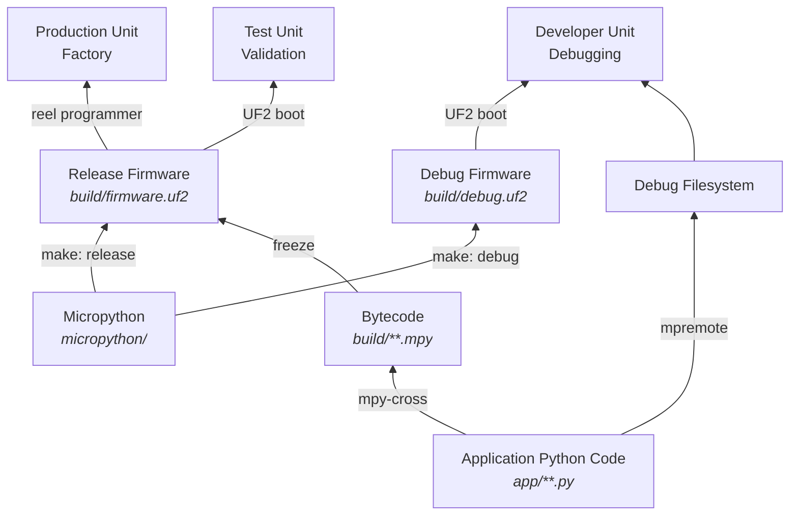

# Compiling This Project

## Graphical Overview



## Release Build Process

To build the release firmware:

```bash
source tools.sh
install_build_tools
build_release
```

Release firmware should be at `build/firmware.uf2`.

## Debug Setup

TODO